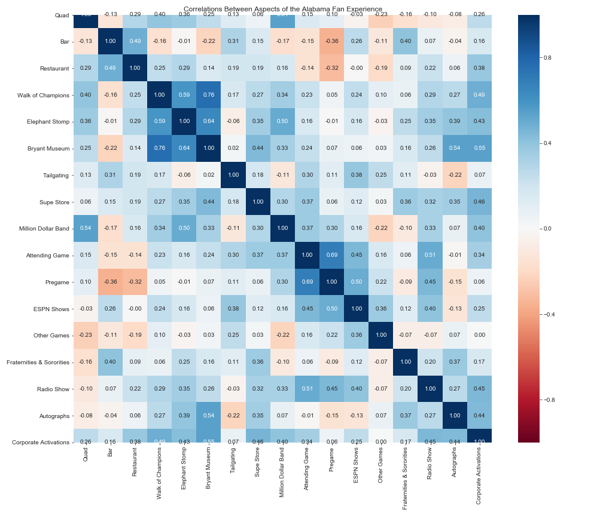
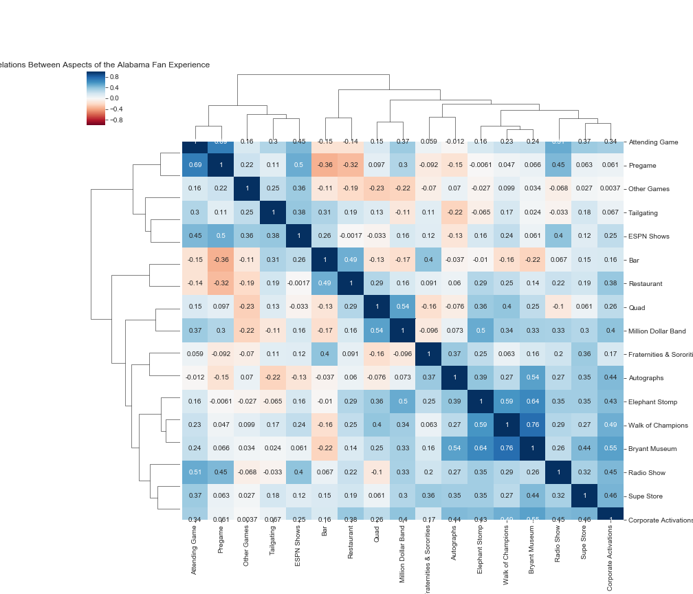

# Alabama Football Game Day Fan Experience

This survey was conducted to identifying important correlations in the fan experience at an Alabama Football game in Tuscaloosa.

## Sample Size Demographics
I personally designed the survey using Google Forms and collected responses from: Facebook, LinkedIn, and Reddit. The sample size is too small to extract any accurate insights but it displays ways of identifying important correlations in the fan/guest experience using survey data. These correlations will help live event experience decision making related to: branding, marketing and ticket package development.

## Findings

### Experiences
- Visiting the Quad
- Visiting a local bar
- Visiting a local restaurant
- Attending the Walk of Champions
- Attending the Elephant Stomp
- Visiting the Bryant Museum
- Tailgating or visiting a tailgate 
- Visiting the Supe Store and/or other merchandise vendors
- Watching the Million Dollar Band at halftime
- Watching the game inside Bryant Denny Stadium
- Watching pre-game activities inside Bryant Denny Stadium (warm-ups, flyover, highlight videos, etc.)
- Watching ESPN College Gameday, SEC Nation, etc. (on television or live on campus) 
- Watching other games
- Visiting a fraternity or sorority house
- Listening to the Crimson Tide Sports Network
- Autograph sessions with other teams or celebrities
- Visiting corporate activations (Coca-Cola Kickoff Zone, Mercedes Benz Fan Fest, Nissan Heisman House, etc.)

## Progress
- [x] Create Survey
- [x] Data Collection
- [x] Data Cleaning
- [x] Data Analysis
- [x] Data Visualization
- [x] Data Visulizations by Age Group
- [x] Statistical Testing
